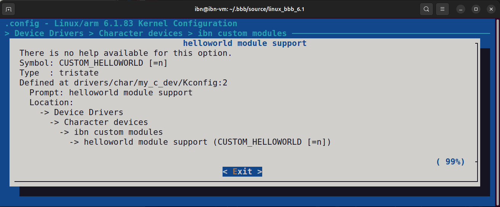
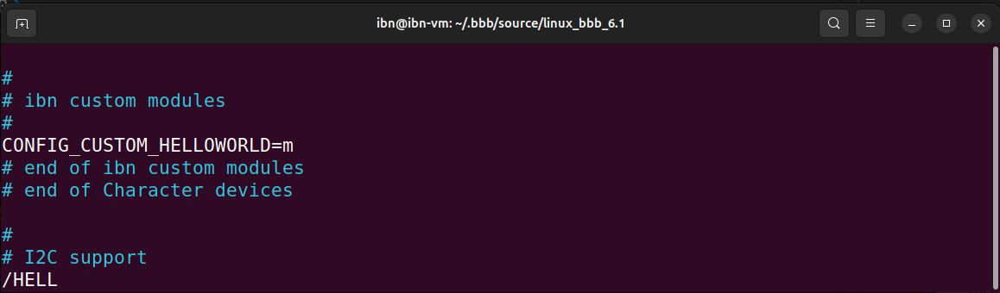

### In-tree building  
- You have to add the Linux kernel module inside the Linux kernel source tree and let the Linux build system builds that.    
- If you want to list your kernel module selection in kernel **menuconfig**, then create and use a Kconfig file      

### Step to add in-tree module to kernel menu configuration   

1. Create a folder in linux tree **drivers/char/**`my_c_dev ` 
2. Copy `main.c` from previous project `000_helloworld_out_of_tree`  
3. Create Kconfig file and add the below entries   
```kconfig
menu "my custom modules"
  config CUSTOM_HELLOWORLD
    tristate "hello world module support"
    default n
endmenu
```       
5. *default* could be `m`, `n` or `y` (i.e. tristate). By default this modules will be selected as dynamically (`m`) loadable module.
6. `CUSTOM_HELLOWORLD` will appear in the `.config `file when you do the configuratin.    
7. Add the local Kconfig entry to upper level Kconfig (at `drivers/char/Kconfig`) 
```bash
pc@ubuntu:~/.bbb/source/linux_bbb_6.1$ cd drivers/char/
pc@ubuntu:~..linux_bbb_6.1/drivers/char$ mkdir my_c_dev && cd my_c_dev
pc@ubuntu:~..linux_bbb_6.1/drivers/char/my_c_dev$ touch Kconfig
pc@ubuntu:~..linux_bbb_6.1/drivers/char/my_c_dev$ cp ../../../../../custom_drivers/000_helloworld_out_of_tree/main.c .
pc@ubuntu:~..linux_bbb_6.1/drivers/char/my_c_dev$ cd ../
pc@ubuntu:~..linux_bbb_6.1/drivers/char$ sudo nano Kconfig
```    
**Upper level Kconfig**     
```bash 
config RANDOM_TRUST_BOOTLOADER
        bool "Initialize RNG using bootloader-supplied seed"
        default y
        help
          Initialize the RNG using a seed supplied by the bootloader or boot
          environment (e.g. EFI or a bootloader-generated device tree). This
          seed is not used directly, but is rather hashed into the ....

# Add this line at the end
source "drivers/char/my_c_dev/Kconfig"

endmenu

```
8. Create a local Makefile   
9. Add `obj-$(config_item) += <module>.o` into local Makefile **my_c_dev/Makefile**     
```Makefile
# Prefix your Kconfig `CUSTOM_HELLOWORLD` identifier with `CONFIG_` keyword to get the option `m`, `n`, or `y` from user
obj-$(CONFIG_CUSTOM_HELLOWORLD) += main.o
```   
10. Add the local level Makefile to higher level Makefile `cd drivers/char` and `sudo nano Makefile`, Go at the end  
```Makefile
obj-$(CONFIG_XILLYBUS_CLASS)    += xillybus/
obj-$(CONFIG_POWERNV_OP_PANEL)  += powernv-op-panel.o
obj-$(CONFIG_ADI)               += adi.o

# Add this at the end, we wrote `obj-y` because that folder is always selected. As we don't have any config item for the folder to select. But only to select the kernel module under that menu we have config item.
obj-y                           += my_c_dev/
```     

> [Kconfig language Referance](https://www.kernel.org/doc/Documentation/kbuild/kconfig-language.txt)     
     
### Test menuconfig    
     
At the top level directory where linux is placed
```bash
pc@ubuntu:~..linux_bbb_6.1$ make ARCH=arm menuconfig
```    
- Go to **Device drivers** > **Character devices** > **ibn custom modules**   
- **ibn custom modules** is our module. You can go inside and see it's not selected by default (as we gave `n` previously to module `my_c_dev`'s Kconfig).    
- Selecting **<Help\>** will show following screen.     

     

- Now you can go back and toggle between `M` (Dynamic), or `*` (Statically build) by hitting Space bar   
- Select `M` *Exit* and *Save*     
- You can find your entry (`CONFIG_CUSTOMHELLOWRLD=m`) in the config.    
```bash
pc@ubuntu:~..linux_bbb_6.1$ vim .config  

# Now type /HELLO and it will search and show your menuconfig entry
```       
      
    
- Lets quit vim by typing `:q!`    

### Build Custom module
Let's run the module building command once again to build your module.   
```bash
pc@ubuntu:~..linux_bbb_6.1$ make ARCH=arm CROSS_COMPILE=arm-linux-gnueabihf- modules -j4    
    
# You cd into your modules directory and find the module information by running following commands   
pc@ubuntu:~..linux_bbb_6.1$ cd drivers/char/my_c_dev
pc@ubuntu:~..linux_bbb_6.1/drivers/char/my_c_dev$ modinfo main.ko 
```     

    