# Embedded linux device driver programming   

## Host (Ubuntu) preparation   
```bash
$ sudo apt-get update 

$ sudo apt-get install build-essential lzop u-boot-tools net-tools bison flex libssl-dev libncurses5-dev libncursesw5-dev unzip chrpath xz-utils minicom liblz4-tool
```       
    
To cross-compile Linux kernel, Linux application, and kernel
modules to ARM Cortex Ax architecture, we need a cross compiler.    
     
The SOC AM335x from TI, is based on ARM Cortex A8 processor of
ARMv7 architecture     
     
Download Linaro [cross compiler and toolchain](https://releases.linaro.org/components/toolchain/binaries/7.5-2019.12/arm-linux-gnueabihf/) for 64 bit host Ubuntu `gcc-linaro-7.5.0-2019.12-x86_64_arm-linux-gnueabihf.tar.xz` OR simply run following commands to download and extract into your **workspace** directory.     
     
```bash
$ wget https://releases.linaro.org/components/toolchain/binaries/7.5-2019.12/arm-linux-gnueabihf/gcc-linaro-7.5.0-2019.12-x86_64_arm-linux-gnueabihf.tar.xz   

$ mkdir -p ~/workspace && mv gcc-linaro-7.5.0-2019.12-x86_64_arm-linux-gnueabihf.tar.xz ~/workspace && cd ~/workspace

workspace$ tar Jxf gcc-linaro-7.5.0-2019.12-x86_64_arm-linux-gnueabihf.tar.xz     
```    

> Add an entry into ~/.bashrc file to export the toolchain and to make it available in the terminal.    
`export PATH=$PATH:<path_to_toolchain_binaries OR ~/workspace/gcc-linaro-7.5.0-2019.12-x86_64_arm-linux-gnueabihf/bin>`    
    
### Getting your board ready    
We will create two partition on the SD Card as follows (images for `MLO`, `u-boot.img` and kernel image `uImage`, device tree `am335-boneblack.dtb` as well as environment variable file `uEnv.txt` are placed in the repo under [pre-built-images](./pre-built-images/) directory) download and place it into your **workspace** directory       
     
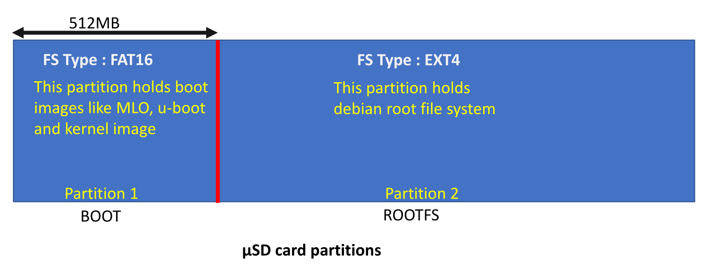    

Download latest Debian release [Beaglebone black SD card image](https://www.beagleboard.org/distros/am335x-12-2-2023-10-07-4gb-microsd-iot) and extract it into your **workspace** folder      
This release comes with:   
- Kernel: 5.10.168-ti-r72
- U-Boot: v2022.04
- default username|password is **debian**|**temppwd**   
    
```bash
workspace$ wget https://files.beagle.cc/file/beagleboard-public-2021/images/am335x-debian-12.2-iot-armhf-2023-10-07-4gb.img.xz  
workspace$ unxz am335x-debian-12.2-iot-armhf-2023-10-07-4gb.img.xz
```  

> Now your workspace directory should contain **pre-buil-images**, Debian release **am335x-debian-12.2-iot-armhf-2023-10-07-4gb** as well as cross compiler tool chain from Linaro **gcc-linaro-7.5.0-2019.12-x86_64_arm-linux-gnueabihf**     

Download **GParted Partition Editor** from Ubuntu *App Center* to format your SD Card     

### microSD card preparation      
1. You can use 8/16/32 GB μSD card   
2. Connect the μSD card to PC using card reader   
3. Launch the gparted application  
4. Make 2 partitions (fat16 and ext4)  
5. Configure the boot, `lba` and `boot` flags on the boot partition with the size as 256 or 512MB or upto 1GB.  
6. Copy boot images on FAT16 partition ( this is boot partition 512MB size)   
7. Copy debian root file system on ext4 partition   
8. Unmount and remove the μSD card from the PC   
9. Insert the μSD card into BBB μSD card slot   
10. Boot from SD card interface (mmc0 interface)     

> Dont forget running `sync` command after `cp`. As `sync` command may take longer and you can watch the working by `watch -d grep -e Dirty: -e Writeback: /proc/meminfo`


## Target preparetion (Beaglebone black)      

Official website for [Beaglebone black](https://www.beagleboard.org/boards/beaglebone-black).  
    
[Design](https://git.beagleboard.org/beagleboard/beaglebone-black) contain Beaglebone black **Schematic** and **Reference Manual** in *Docs* folder of this repository.  

Go to [wiki](https://elinux.org/Main_Page) and find your board BeagleBone Black for ton of information)   

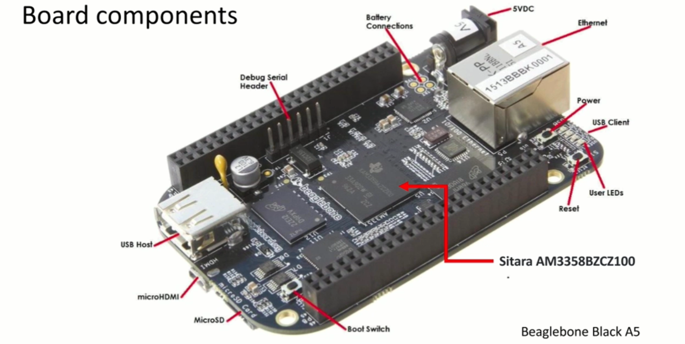    

By default Board will run Debian from eMMC however will boot from SD Card       
     
    

### Usage of Power, reset and boot button
button
- **Power button**: By press and hold this button for 10 to 20 seconds, you can power
down the board. And power up the board by pressing it again. Useful instead of connecting and disconnecting
power sources to your board now and then
     
- **Reset button**: Pressing this button resets the board. Note that the boot sequence
is not affected by the reset action.      
     
- **Boot button**: you can use this button to change the boot sequence during powerup of the board.             
     
### Boot squence of BeagleBone Black   
     
    

These settings affect by `SYSBOOT[4:0]` control register      
     
### Booting from μSD card interface    

1. Make sure that BBB is not powerd up    
2. Connect [serial debug cable](https://www.adafruit.com/product/954) between BBB and Host. Running the `dmesg` command will show it as **cp210x** and message **cp210x converter now attached to ttyUSB0** and then run `sudo minicom -s`. Go little further down to see how to configure minicom    
3. Insert the SD card to BBB    
4. Give power to the board using mini usb cable
5. **Press and hold** the boot button (**S2**)    
6. **Press and hold** the power button (**S3**) until the blue LED turns off and turns ON
again. (if blue LED doesn’t turn ON, gently press the power button again)    
7. Release the S2 button after 2 to 5 seconds     
8. beaglebone login: **debian** and password: **temppwd**    
9. Lets invalidate the MMC1(eMMC) boot image so we can boot straight from microSD card without needing to press S2 and S3 buttons. Run following commands inside Beaglebone Black.      
```bash
debain@beaglebone:~$ sudo -s
root@beaglebone:/home/debian> mkdir /media/tmp1   

# If  you beagleboard is pre-installed with newer Debian eMMC image, then you may not see `/dev/mmcblk1p2` and you may not find `MLO` file. In that case skip rest of the commands below.
root@beaglebone:/home/debian> mount /dev/mmcblk1p1 /media/tmp1
root@beaglebone:/home/debian> cd /media/tmp1
root@beaglebone:/home/debian> mv MLO MLO.bak
root@beaglebone:/home/debian> sync
root@beaglebone:/home/debian> shutdown -h now
```      
- Now you can remove the USB cable to Turn the Beaglebone off and Put it back on. This time board should boot from microSD Card.      
      
### Boot from microSD Card on newer eMMC chips       

If you didnt see the `mmcblk1p2` in previous section then your Beaglebone Black have the newer eMMC chip installed. Which can also confirm by running the `lsblk` command which output your microSD card as `mmcblk0` and your eMMC chip as `mmcblk1` as show below     

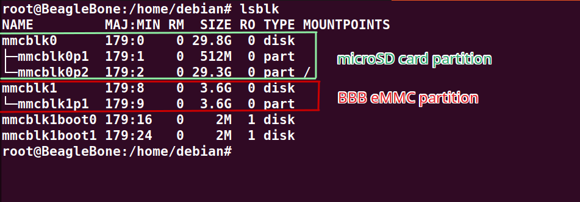         
     
Now, if you mount the mmcblk1 to any mountpoint, for example, `/mnt/` then you won't find any **MLO** in `/mnt/boot`   
```bash
root@beaglebone:/home/debian> mount /dev/mmcblk1p1 /mnt/
root@beaglebone:/home/debian> cd /mnt/boot && ls
```     
     
Reason being is new BBB eMMC contain only one partition `mmcblk1p1` of type *ext4*. And it doesn't copy the MLO and U-boot into this partition. It only has 1MB MBR which contain MLO and U-boot. As this MBR is not filesystem, hence you cannot mount it. These MLO and U-boot are hardcoded into this MBR. If you want your BBB to force boot from microSD card then you have to remove the MBR (which you can recover later without being worried of ruining it).    
    
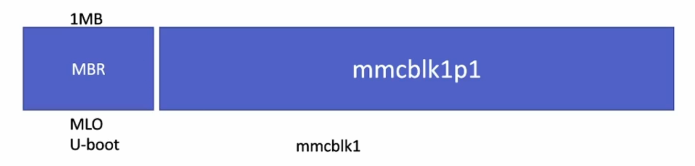      
     
Let's unmount the partition we mounted for demonstration by running command `$ umount /mnt/`.  
We would first take the snapshot of MBR into some file (i.e. output file name as `emmcboot.img`) to keep it in safe place so we can recover it later.     
```bash
# keep the snapshot file `emmcboot.img` somewhere safe which will be found in the `/home/debian` directory
root@beaglebone:/home/debian> dd if=/dev/mmcblk1 of=emmcboot.img bs=1M count=1
```      
     
Now zero out the MBR 1MB as follows:   
```bash
root@beaglebone:/home/debian> dd if=/dev/zero of=/dev/mmcblk1 bs=1M count=1
```     
     
Now take out the USB cable from the PC and put it back in to power up the Beablebone Black. Now you will see it will run from microSD Card.     
    
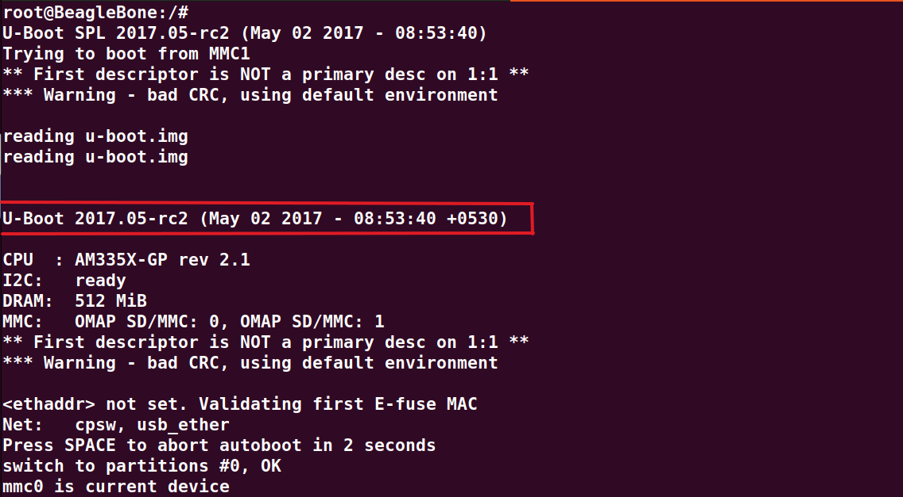    

### Recover MBR later     
```bash
root@beaglebone:/home/debian> dd if=emmcboot.img of=/dev/mmcblk1 bs=1M count=1
```     
    
> Through out the development of device driver we will boot from microSD card and we will not use eMMC chip to boot up the BBB.    


## Connecting BBB and USB to serial TTL convertor hardware or cable    
    
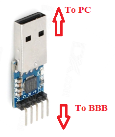   
   
Or you may use the [USB to serial TTL](https://www.adafruit.com/product/954) converter

This cable has embedded “USB to serial “converter chip inside.  
   
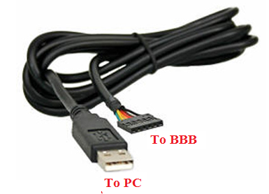   
   
And always remember when you connect  “USB to Serial Convertor” to any hardware like BBB, the TX pin of this module should go to the RX pin of the another board, in this case BBB. Take look in to the table below for connection details. It’s very simple.   
   
     

This **usb to ttl** from Adafruit has coloring; **Red Power**, **Black GND**, **Green Tx**, and **White Rx**      
     
> The power pin provides the 5V @ 500mA direct from the USB port and the RX/TX pins are 3.3V level for interfacing with the most common 3.3V logic level chipsets.   
> Running the `dmesg` command will show it as **cp210x** and message **cp210x converter now attached to ttyUSB0**    
   
Here is a BBB schematic details of J1 UART0 pins   
    
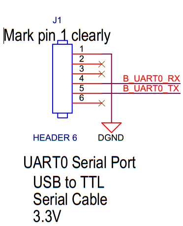   
   
## Serial port monitoring software   
    
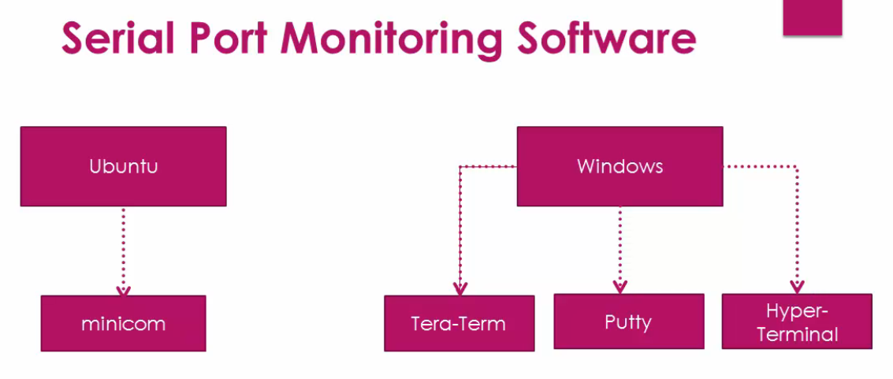   
   
**Using Minicom**   
   
Confirm by running `sudo minicom -s` command in terminal to see if `Minicom` already installed  
    
OR   
   
Install on Ubuntu by first running `sudo apt-get update` and then `sudo apt-get install minicom`   
   

### Configure minicom on first time install    
   
Just connect your USB to UART convertor hardware to the PC (not beaglebone hardware.)  
   
Run the `dmesg` on terminal   
     
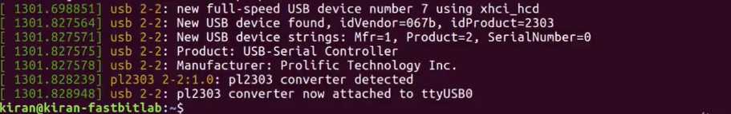   
      
> Chipset converter `pl2303` is detected and attached to ttyUSB0. Alternatively, if you are using FTDI, then following output will be shown in terminal as shown below    
   
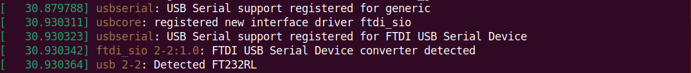    
   
Type `sudo minicom -s` to configure the minicom and configure `Serial port setup` by choosing  
    
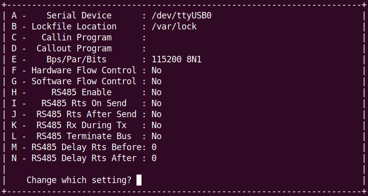   
   
Keep the **Hardware Flow Control** and **Software Flow Control** as **No** as according to BBB Schematic, it doesn't have this feature available on the board as shown below.         
    
   
   
Finally enter **Save setup as dfl** so we don't have to setup the configuration again and again.    

> To completly exiting the minicom app, you have to press **CTRL+A** than press **X**
     
### Steps to update the linux kernel image     
     
- Clone the latest stable kernel source from [BBB official github](https://github.com/beagleboard/linux). First find the latest branch from dropdown menu, for example, `v6.1.83-ti-r37` and simply clone it simply prefixing the version number with `linux_bbb_` as follows   
```bash
$ git init
$ git clone https://github.com/beagleboard/linux.git linux_bbb_6.1
$ git checkout v6.1.83-ti-r37
$ git branch  # confirm you are in the latest branch `v6.1.83-ti-r37`
```    
     
- Compile and generate the kernel image     
- Update the SD card with new kernel image and boot again       

### Kernel compilation steps     
**Step 1**    
Removes all the temporary folder object files, images generated during the previous build. This step also delete the .config file if created previously. This is just the general guideline as we haven't build anything previously :)    
```bash
$ cd linux_bbb_6.1
linux_bbb_6.1$ make ARCH=arm distclean
```          
     
**Step 2**     
Creates a `.config` file by using default config file given by the vendor. You will find it inside `arch/arm/configs` directory     
```bash
linux_bbb_6.1$ make ARCH=arm bb.org_defconfig
```       
    
**Step 3**    
*This step is optional*. Run the command only if you want to change some kernel settings before compilation.    
```bash
linux_bbb_6.1$ make ARCH=arm CROSS_COMPILE=arm-linux-gnueabihf- menuconfig
```      
      
**Step 4**   
Kernel source code compilation. This stage creates a kernel image `uImage` also all the device tree source files will be compiled, and dtbs will be generated.     
```bash
linux_bbb_6.1$ make ARCH=arm CROSS_COMPILE=arm-linux-gnueabihf- uImage dtbs LOADADDR=0x80008000 -j4
```       
    
**Step 5**     
This step builds and generates in-tree loadable(M) kernel modules (**.ko**)    
```bash
linux_bbb_6.1$ make ARCH=arm CROSS_COMPILE=arm-linux-gnueabihf- modules -j4  
```     
     
**Step 6**     
This step installs all the generated **.ko** files in the default path of the host pc (**/lib/modules/<kernel_ver>**)    
```bash
linux_bbb_6.1$ sudo make ARCH=arm modules_install
```    
     
### Update kernel image and kernel modules in SD card    
    
- Copy `uImage` from the host pc `arch/arm/boot/` into the microSD card's `BOOT` partition. Similarly `am335x-boneblack.dtb` from the host pc `arch/arm/boot/dts/` and into microSD cards's `BOOT` partition.   
- Copy content of newly installed **6.1.83** folder in host pc (`/lib/modules/`) to board's `/lib/modules/` folder.    
```bash
pc@ubuntu:/lib/modules$ sudo cp -a 6.1.83 /media/<ubuntu-username>/ROOTFS/lib/modules
```      
- Reset the board (you should see BBB boots with newly updated
kernel image)         
    
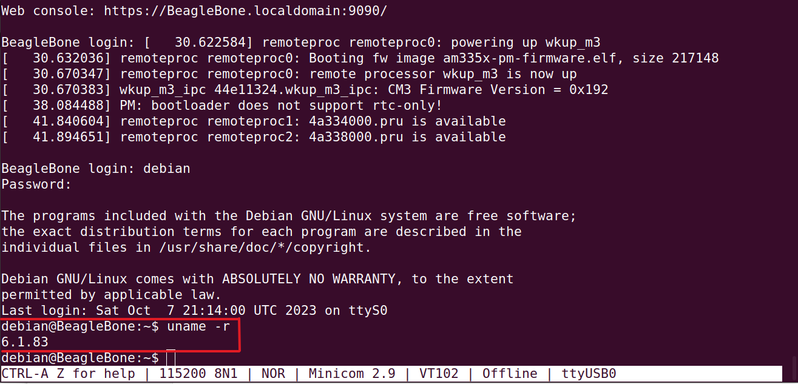      

### Internet over USB  

- Beaglebone board can communicate to the internet over the USB cable by sharing your PC’s internet connection.       
- You need not to use a separate ethernet cable to connect your board to internet.      
- The required drivers are enabled by default in the kernel and loaded when Linux boots on the BBB      
- But you must enable internet sharing on your HOST       

**Target (BBB) settings**:    
    
Inside BBB run the `ifconfig` and check the `usb0` which for example has `192.168.7.2` ip. Now ping the host with the ip `192.168.7.1`    
```bash
debian@BeagleBone:~$ ifconfig
...
...
usb0: flags=4163<UP,BROADCAST,RUNNING,MULTICAST>  mtu 1500
        inet 192.168.7.2  netmask 255.255.255.0  broadcast 192.168.7.255
        inet6 fe80::1eba:8cff:fea2:ed6b  prefixlen 64  scopeid 0x20<link>
        ether 1c:ba:8c:a2:ed:6b  txqueuelen 1000  (Ethernet)
        RX packets 87  bytes 13336 (13.0 KiB)

debian@BeagleBone:~$ ping 192.168.7.1
64 bytes from 192.168.7.1: icmp_seq=1 ttl=64 time=6.29 ms
64 bytes from 192.168.7.1: icmp_seq=2 ttl=64 time=3.47 ms
64 bytes from 192.168.7.1: icmp_seq=3 ttl=64 time=7.22 ms
```      

This shows you are able to establish the connection with host over usb. However if you try to pin `www.google.com`. You will get an error     
```bash
debian@BeagleBone:~$ ping www.google.com
ping: www.google.com: Temporary failure in name resolution
```   
    
Above error *Temporary failure in name resolution* means we have to set DNS server address    

- Add name server address in: `/etc/resolv.conf`   
  - nameserver 8.8.8.8
  - nameserver 8.8.4.4          

Add default gateway address by running the command below in the **BBB**.    
> [!IMPORTANT]  
> You have to run following command in the **BBB** everytime you reboot your device  
```bash
# using PC as a default gateway
debian@BeagleBone:~$ route add default gw 192.168.7.1 
```      

> [!IMPORTANT]  
> In Host you must make sure that IP packet forwarding is enabled and also you have to run following command(s) in the **Host machine** on device (BBB) reboot   
```bash
# search for `net.ipv4.ip_forward=1` in `/etc/sysctl.conf`
pc@ubuntu:$ sudo nano /etc/sysctl.conf   

# share you internet connection with beaglebone black hardware
# In the place of `wlp2s0` use your network interface name by running `ifconfig`
pc@ubuntu:$ iptables --table nat --append POSTROUTING --out-interface wlp2s0 -j MASQUERADE
pc@ubuntu:$ iptables --append FORWARD --in-interface wlp2s0 -j ACCEPT
pc@ubuntu:$ echo 1 > /proc/sys/net/ipv4/ip_forward
```       
OR save the following script in the HOST PC with, for example `usbnet.sh` name, and change the permission with `chmod +x usbnet.sh` so to easier to run in one go after reboot Beaglebone black. **Dont forget to replace `ens33` with your network interface by running `ifconfig`**    
```bash
#!/bin/bash
iptables --table nat --append POSTROUTING --out-interface ens33 -j MASQUERADE
iptables --append FORWARD --in-interface ens33 -j ACCEPT
echo 1 > /proc/sys/net/ipv4/ip_forward
```    

Now you can ping `www.google.com` and update the system
```bash
debian@BeagleBone:~$ ping www.google.com

debian@BeagleBone:~$ sudo apt-get update
```    
     


            
    
 
    


